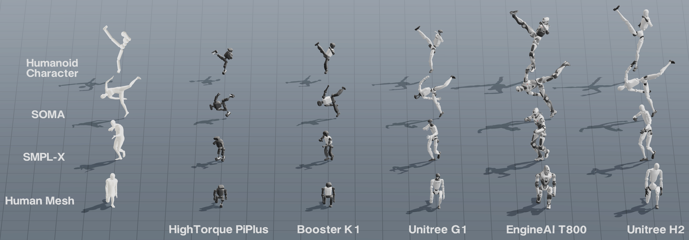

<h1 align="center">
  Unified Motion Retargeting for Humanoids with Learned Point Cloud Correspondence
</h1>

<p align="center">
  Hanyang Cao<sup>1,2,*</sup>,
  Yuetong Fang<sup>1,2,*</sup>,
  Taesoo Kwon<sup>3,*</sup>,
  Runyi Yu<sup>2,4</sup>,
  Ji Ma<sup>5</sup>,
  Jing Tan<sup>1,2</sup>,<br>
  Yangchen Zhou<sup>1</sup>,
  Baoze Du<sup>2</sup>,
  Yi Gu<sup>1</sup>,
  Yukang Gao<sup>1,2</sup>,
  Ruoli Dai<sup>2</sup>,
  Lei Han<sup>2,†</sup>,
  Renjing Xu<sup>1,†</sup>
</p>

<p align="center">
  <sup>1</sup>HKUST (Guangzhou)&nbsp;&nbsp;
  <sup>2</sup>Noitom Robotics&nbsp;&nbsp;
  <sup>3</sup>Hanyang University&nbsp;&nbsp;
  <sup>4</sup>HKUST&nbsp;&nbsp;
  <sup>5</sup>HKU
</p>

<p align="center">
  <sup>*</sup>Equal contribution&nbsp;&nbsp;&nbsp;
  <sup>†</sup>Corresponding authors
</p>

<p align="center">
  <a href="https://hanyang9.github.io/UMR/"></a>
  <a href="https://arxiv.org/abs/2609.02134"></a>
</p>

---

<p align="center">
  
</p>

UMR treats the moving exterior body surface as a shared interface between human
motion and humanoid robots. It has two main stages:

- **Point Cloud Correspondence Learning** learns ordered source-robot surface
  correspondence in aligned canonical poses.
- **Correspondence-Guided Retargeting** optimizes robot motion using matched
  surface positions, orientations, contacts, and kinematic constraints.

A learned correspondence is reused by motions with the same source template
and target robot.

## Supported Motion Sources

UMR samples the moving exterior surface, so any source with surface-level motion
information can be integrated through the same formulation.

| Motion source | Dataset | Adapter guide |
| --- | --- | --- |
| BONES-SEED / SOMA | [BONES-SEED](https://huggingface.co/datasets/bones-studio/seed) | [`sample_data/bones-seed/README.md`](sample_data/bones-seed/README.md) |
| GRAIL | [NVIDIA GRAIL](https://huggingface.co/datasets/nvidia/PhysicalAI-Robotics-Locomanipulation-GRAIL) | [`sample_data/grail/README.md`](sample_data/grail/README.md) |
| OmniContact | [Paper and dataset](https://huggingface.co/papers/2606.26201) | [`sample_data/omnicontact/README.md`](sample_data/omnicontact/README.md) |
| LAFAN1 / SMPL-X | [LAFAN1](https://github.com/ubisoft/ubisoft-laforge-animation-dataset) | [`sample_data/lafan1_smplx/README.md`](sample_data/lafan1_smplx/README.md) |
| OMOMO | [OMOMO](https://github.com/lijiaman/omomo_release) | [`sample_data/omomo/README.md`](sample_data/omomo/README.md) |
| Humanoid Character | [MimicKit](https://github.com/xbpeng/MimicKit) | [`sample_data/humanoid_character/README.md`](sample_data/humanoid_character/README.md) |
| AdaPT body+racket | [AdaPT](https://humanoidtennis.github.io/AdaPT/) | [`sample_data/adapt/README.md`](sample_data/adapt/README.md) |
| NR FBX/BVH | FBX/BVH motion | [`sample_data/nr/README.md`](sample_data/nr/README.md) |

> **OmniContact support.** An internal development version of UMR was used to produce the Unitree G1 retargeting data released by [OmniContact](https://omnicontact.github.io/). OmniContact provides the source motions as BVH, while UMR uses SMPL-X inputs. The internal BVH-to-SMPL-X converter is not included in this repository, so the current release does not directly support these BVH files.

For LAFAN1, use [`lafan_to_smplx`](https://github.com/jaraujo98/lafan_to_smplx)
to convert BVH motion to SMPL-X before retargeting. Each adapter guide documents
the expected local layout.

## Installation

```bash
conda create -n umr python=3.12 pip -y
conda activate umr
python -m pip install --index-url https://download.pytorch.org/whl/cu121 torch==2.4.1
python -m pip install -r requirements-umr.txt
```

### SMPL-X Body Models

SMPL-X body-model files are not distributed with this repository. Download
them from the official SMPL-X provider after accepting its terms. Both `.pkl`
and `.npz` models are supported; place at least the neutral model at:

```text
smpl/SMPLX_NEUTRAL.pkl
# or
smpl/SMPLX_NEUTRAL.npz
```

Add `SMPLX_MALE` and `SMPLX_FEMALE` in either format when a sequence requires
those genders. The NPZ path has been tested with both neutral SMPL-X motion and
female OMOMO motion.

The GRAIL example applies its bundled G1-SMPL-X template and pose-corrective
overlay to the user-provided neutral SMPL-X model at runtime; the derived baked
SMPL-X weights are not distributed.

## Quick Start

Retarget the included LAFAN1-derived SMPL-X motion:

```bash
python scripts/humanoid_retarget_pipeline.py \
  --config robot_configs/humanoid_retarget_unitree_g1_example.json
```

The default configuration uses the included LAFAN1-derived SMPL-X sequence
`sample_data/lafan1_smplx/dance1_subject2.npz`. It builds or reuses the learned
point-cloud correspondence, runs correspondence-guided retargeting, and opens
the MuJoCo viewer.

To use another robot, copy the example config in `robot_configs/` and update
its name and MJCF path. Prepare the robot T-pose in
[UMR Studio](https://hanyang9.github.io/UMR/umr_studio.html): load the robot
asset folder, select its MJCF, adjust it into a T-pose, and click **Copy T-pose
Config**. Paste the copied `tpose_qpos` into the new robot config, then run the
pipeline with that config. No manual human-robot mapping is required.

The same surface-based formulation is exposed for other motion representations
and interaction settings:

```bash
# BONES-SEED SOMA motion
python scripts/humanoid_retarget_pipeline.py \
  --config robot_configs/humanoid_retarget_unitree_g1_example.json \
  --defaults humanoid_retarget_defaults_bones_seed.json

# Humanoid Character spin-kick
python scripts/humanoid_retarget_pipeline_character.py \
  --config robot_configs/humanoid_retarget_unitree_g1_example.json

# GRAIL human-scene interaction
python scripts/humanoid_retarget_pipeline_hsi_hoi.py \
  --config robot_configs/humanoid_retarget_unitree_g1_example.json \
  --defaults humanoid_retarget_defaults_hsi_hoi_grail.json

# OmniContact human-object interaction (pre-converted SMPL-X input)
python scripts/humanoid_retarget_pipeline_hsi_hoi.py \
  --config robot_configs/humanoid_retarget_unitree_g1_example.json \
  --defaults humanoid_retarget_defaults_hsi_hoi_standard.json

# OMOMO human-object interaction
python scripts/humanoid_retarget_pipeline_hsi_hoi.py \
  --config robot_configs/humanoid_retarget_unitree_g1_example.json \
  --defaults humanoid_retarget_defaults_hsi_hoi_standard.json \
  --data sample_data/omomo \
  --seq-key sub1_plasticbox_015

# NR FBX/BVH human motion
python scripts/humanoid_retarget_pipeline_nr.py \
  --config robot_configs/humanoid_retarget_unitree_g1_example.json

# AdaPT body+racket correspondence and retargeting
python scripts/humanoid_retarget_pipeline_adapt.py
```

## Visualize a Result

Results contain the final robot `qpos` and the metadata required by the GLFW
MuJoCo viewer:

```bash
python scripts/visualize_robot_retarget_result.py \
  --result output/unitree_g1_retarget/dance1_subject2_smplx_unitree_g1.npz \
  --play
```

## Batch Retargeting

Run the SMPL-X/LAFAN batch pipeline with:

```bash
python scripts/humanoid_retarget_pipeline_batch.py \
  --config robot_configs/humanoid_retarget_unitree_g1_example.json \
  --batch-config humanoid_retarget_defaults_batch.json
```

BONES-SEED uses its own batch defaults:

```bash
python scripts/humanoid_retarget_pipeline_batch.py \
  --config robot_configs/humanoid_retarget_unitree_g1_example.json \
  --batch-config humanoid_retarget_defaults_batch_bones_seed.json
```

Add `--motion-folder sample_data/bones-seed/motions_proportional/bvh` for the
actor-proportional subset. BONES-SEED associates each `Axxx` motion with its
matching shape and reuses one correspondence per source-template/robot pair.

Batch defaults use **bidirectional warm start with dynamic programming** to
reduce sensitivity to occasional singularities. This mode is recommended for
large-scale retargeting.

| Option | Meaning |
| --- | --- |
| `--motion-folder PATH` | Select the input directory. |
| `--recursive` / `--pattern GLOB` | Control motion discovery. |
| `--workers N` | Set parallel retargeting jobs. |
| `--correspondence-workers N` | Set parallel correspondence preparation jobs. |
| `--retarget-gpus` | Control GPU assignment. |
| `--force-retarget` | Rebuild existing results. |

Results are saved under `output/batch_retarget/<robot-name>/`;
`batch_summary.json` records each clip status.

## Configuration

`--config` selects the target robot. Robot-specific `tpose_qpos`, joint limits,
and model paths belong in this file. `--defaults` selects source- and
task-specific settings.

| Defaults | Source |
| --- | --- |
| `humanoid_retarget_defaults.json` | SMPL/SMPL-X |
| `humanoid_retarget_defaults_bones_seed.json` | BONES-SEED / SOMA |
| `humanoid_retarget_defaults_humanoid_character.json` | Humanoid Character |
| `humanoid_retarget_defaults_hsi_hoi_grail.json` | GRAIL |
| `humanoid_retarget_defaults_hsi_hoi_standard.json` | OmniContact / OMOMO |
| `humanoid_retarget_defaults_nr.json` | NR FBX/BVH |
| `robot_configs/humanoid_retarget_defaults_adapt.json` | AdaPT SMPL-X+racket |

### Surface Objective Weights

Surface weights are defined on the motion source, not per robot:

| Source/task | Parameter file |
| --- | --- |
| SMPL/SMPL-X and SOMA | [`retarget_body_segment_surface.py`](scripts/retarget_body_segment_surface.py) |
| Humanoid Character | [`retarget_body_segment_surface_character.py`](scripts/retarget_body_segment_surface_character.py) |
| HSI/HOI and NR | [`retarget_body_segment_surface_hoi_hsi.py`](scripts/retarget_body_segment_surface_hoi_hsi.py) |
| AdaPT body+racket | [`retarget_body_segment_surface_adapt.py`](scripts/retarget_body_segment_surface_adapt.py) |

Each segment specifies `sample_slots`, `point_cost`, and `normal_cost`. Robots
sharing the same source/task use the same values; only the robot config changes.
Interaction defaults give more weight to end-effector preservation. These
settings work well for G1 and generally transfer to other robots, but may not be
optimal for every embodiment.

## Data Preparation Notes

- For HSI/HOI, convex-decompose concave objects with
  [CoACD](https://github.com/SarahWeiii/CoACD) before retargeting. MuJoCo treats
  a single mesh collision geom as its convex hull.
- BONES-SEED motion and SOMA-X asset placement is documented in the
  [BONES-SEED guide](sample_data/bones-seed/README.md); `py-soma-x` is included
  in the requirements.
- NR FBX/BVH input requires Node.js 18 or newer. The bundled minimal Three.js
  code is used only for FBX mesh parsing, not visualization.

## Citation

If you find UMR useful in your research, please cite the paper:

```bibtex
@misc{cao2026unifiedmotionretargetinghumanoids,
  title={Unified Motion Retargeting for Humanoids with Learned Point Cloud Correspondence},
  author={Hanyang Cao and Yuetong Fang and Taesoo Kwon and Runyi Yu and Ji Ma and Jing Tan and Yangchen Zhou and Baoze Du and Yi Gu and Yukang Gao and Ruoli Dai and Lei Han and Renjing Xu},
  year={2026},
  eprint={2609.02134},
  archivePrefix={arXiv},
  primaryClass={cs.RO},
  url={https://arxiv.org/abs/2609.02134},
}
```
